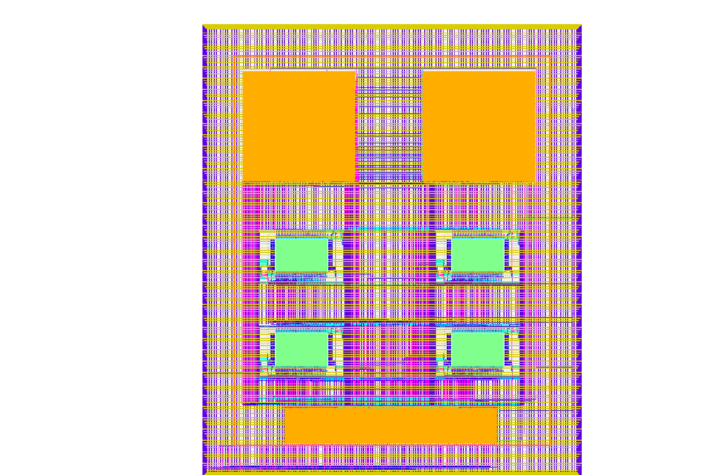
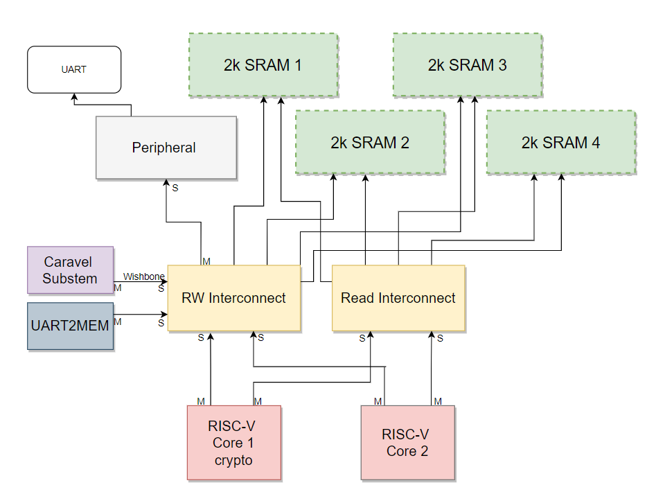

# Soric SoC

 

Soric (Source Opened RISC-V for Cryptography) is an open heterogeneous SoC targeting for application in cryptography and trusted devices. The SoC consists of two RISC-V cores, 4x2kB SRAM and Peripherals (e.g., UART, GPIO). One of the cores supports the RISC-V scalar cryptography extension V1.0.0 which is specified for cryptographic and security critical applications while the other core is responsible for the security non-critical applications.

   

   
   

   

   
   

